# IoTLab Pilot Case - Stufvenäs

## Table of Contents
1. [Introduction](#introduction)
2. [Hardware Suggestion](#hardware-suggestion)
3. [LoRaWAN Gateway](#lorawan-gateway)
4. [Getting Started](#getting-started)
5. [Sensor Configuration](#sensor-configuration)
6. [DataCake Configuration](#datacake-configuration)
    1. [Connect Chirpstack and Datacake](#connect-chirpstack-and-datacake)
    2. [Add Widgets to Your Datacake Dashboard](#add-widgets-to-your-datacake-dashboard)

---

## Introduction
Stufvenäs Gästgifveri is a company located in Kalmar County, Sweden, offering a spa and conference facilities. Recently, they discovered a centuries-old oak tree and constructed a trail through the forest to allow visitors to explore this natural wonder. To secure funding for the trail's maintenance, they need to demonstrate that it is being used by visitors. However, there was no existing LoRaWAN coverage in the area, requiring us to install a gateway on their premises to establish connectivity. We also install a people counter that gives us data on how many visitors are using the trail to the oak. 

## Hardware Suggestion

| Product                                                                                                                                                                                                                      | Price    |
| ---------------------------------------------------------------------------------------------------------------------------------------------------------------------------------------------------------------------------- | -------- |
| [Dragino DLOS8N Outdoor LoRaWAN Gateway](https://iot-shop.de/en/shop/dragino-dlos8n-outdoor-lorawan-gateway-5841?category=7&search=LoRaWAN+Gateway#attr=17051,20022,6145,20023,14699)                                       | 249.90 € |
| [IM Buildings People Counter LoRaWAN Infrared](https://iot-shop.de/en/shop/im-buildings-people-counter-lorawan-infrared-4735?search=counter&order=name+asc#attr=23729,1177,20464,21806,18727,18728,18729,21807,21805,14505) | 248.90 € |
| [IM Buildings Outdoor Case for People Counter](https://iot-shop.de/en/shop/imb-ib002-002-00-im-buildings-outdoor-case-for-people-counter-5166?search=counter&order=name+asc#attr=23332)                                     | 192.90 € |

## LoRaWAN Gateway

The gateway we will use in the pilot case is the Dragino DLOS8N Outdoor LoRaWAN Gateway (8 channels). The Gateway is IP65-rated and can be mounted on a pole or wall.
| 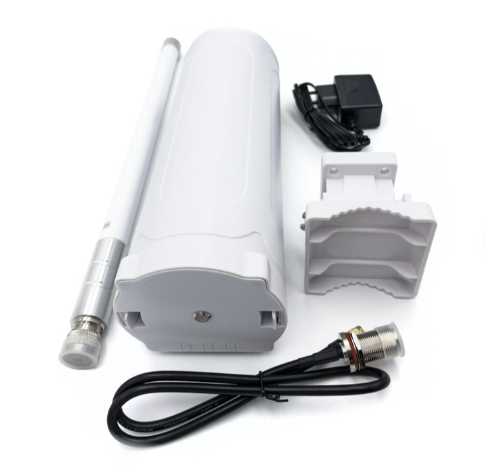 | [Dragino DLOS8N Outdoor LoRaWAN Gateway](https://iot-shop.de/en/shop/dragino-dlos8n-outdoor-lorawan-gateway-5841?category=7&search=LoRaWAN+Gateway#attr=17051,20022,6145,20023,14699) | 249.90 € |
|-|-|-|

## Getting Started
1. Update the firmware on the Dragino DLOS8N Outdoor LoRaWAN Gateway, visit [this guide](https://github.com/iot-lnu/iotlab-pilotcase-hasselo/blob/main/firmware.md)
2. Configure the Dragino DLOS8N Outdoor LoRaWAN Gateway for the Helium network, visit [this guide](https://github.com/iot-lnu/iotlab-pilotcase-hasselo/blob/main/helium.md)

## Sensor Configuration
| 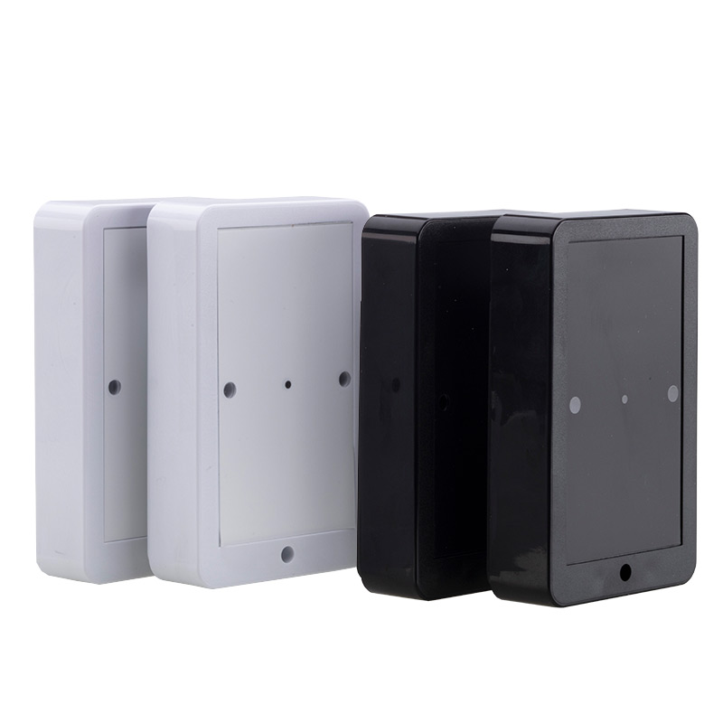 | [IM Buildings People Counter LoRaWAN Infrared](https://iot-shop.de/en/shop/im-buildings-people-counter-lorawan-infrared-4735?search=counter&order=name+asc#attr=23729,1177,20464,21806,18727,18728,18729,21807,21805,14505) | 248.90 € |
|-|-|-|
1. Follow the installation in [this video](https://www.youtube.com/watch?v=m08ACak8ySE) to setup the people counter hardware.
2. **If you use Helium Network**, the following steps applies : 
   1. Connect to [the Helium console](https://console.helium-iot.xyz/front/).
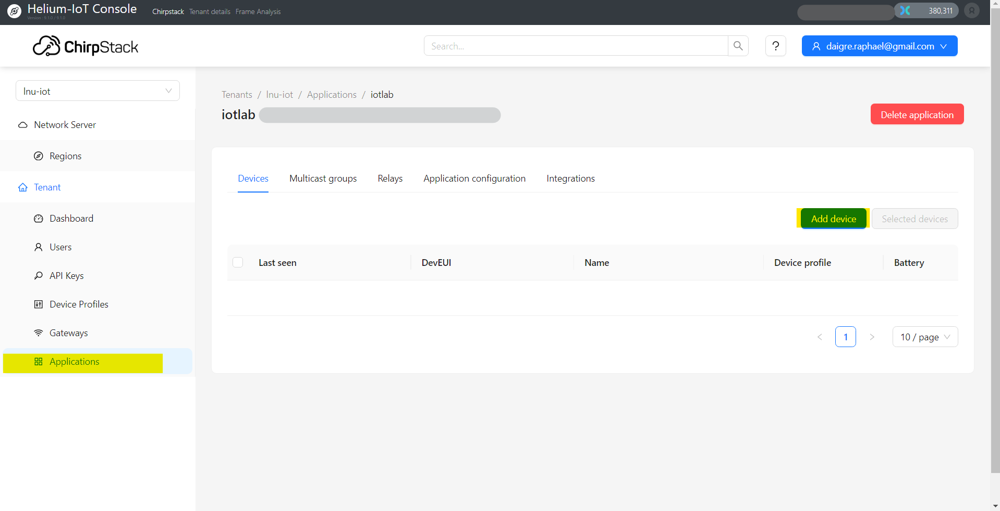
   2. Add the device to your application by taking it's **DevEUI** (you can get while making the hardware setup) and it's **Join EUI** that you also setup during hardware installation.
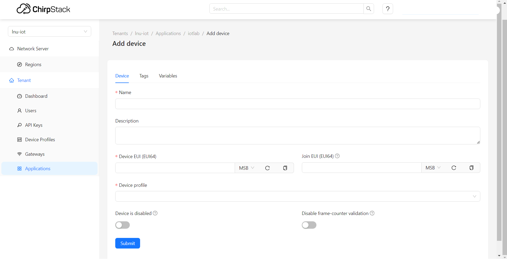
   3. The **device profile** is up to you but for this case, remember that the sensor is a **Class-A**.
    After the device has been added to go to *OTAA keys* and add the *Application key* for your device
    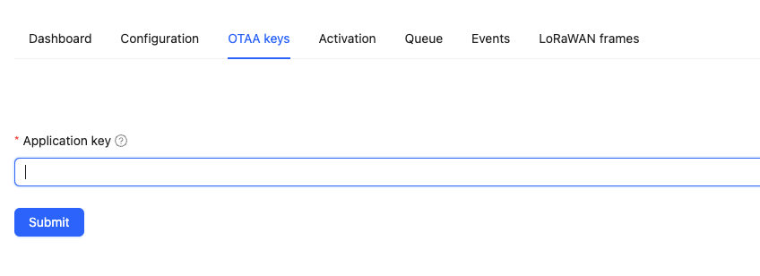

    Your device has now been added, and if it fails to activate please double check that you havent misspelled some of the keys.

## DataCake Configuration
1. Login to Datacake [here](https://app.datacake.de/) with your account
2. Go to *Devices > Add device*. Search for *IMBULDINGS* and choose *IMbuildings People Counter* 
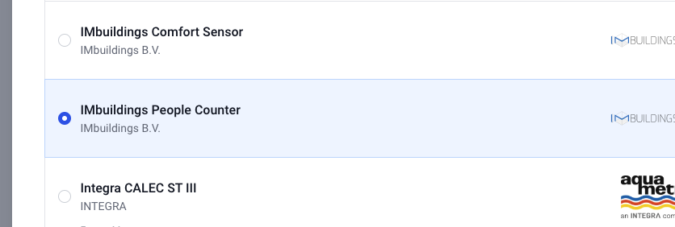

3. Choose **LoRaWAN** and click next. In the next step choose **ChirpStack** as the *Network server* and click next.
4. In the next step add the device **DevEUI** and a *name* and click next.
5. In the last step choose *Free plan*

### Connect Chirpstack and Datacake
#### Add API key
1. Login to your [Helium console](https://console.helium-iot.xyz/)
2. Goto *Tenant > API keys* and add an API key. **Save the key, it cant be seen again.**. Copy the API key

#### Configure datacake
1. Enter your recently added device and click *Configuration*
2. Scroll down to the LoRaWAN section and click the *Change* button to configure Chirpstack downlink.
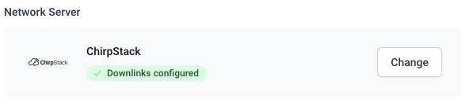
3. Choose *Chirpstack* if its not already choosen as the Network server
   - **Chirpstack Version**: Version 3 (REST)
   - **Chirpstack URL**: https://console.helium-iot.xyz
   - **Chirpstack API Key**: Paste the API key we created and copied earlier from Helium console.
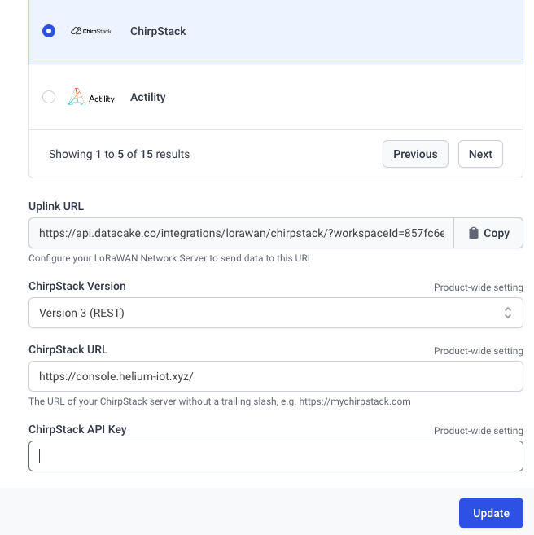

Now your Datacake and Chirpstack should be connected and we should be able to add widgets to visualize the data coming from your device through chirpstack.

### Add Widgets to Your Datacake Dashboard
1. Go to *Devices* in the left pane and choose the device we added.
- Click the *toggle button* and then *Add widget* and choose *Value* in the window that pops up. 
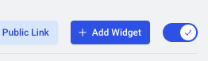

2. *Edit Value Widget* window should pop up. Enter a *Title* under *Basics*. 
3. Go to *Data* and choose *Battery Voltage* under *Field*
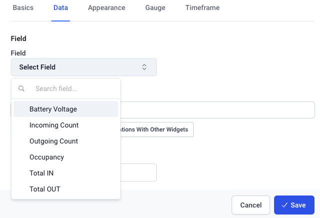

3. Click save and your new widget should appear. **It wont usually update until next payload comes in from Chirpstack.**
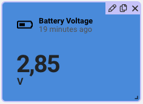

Proceed with adding more widgets and finally it could look like this
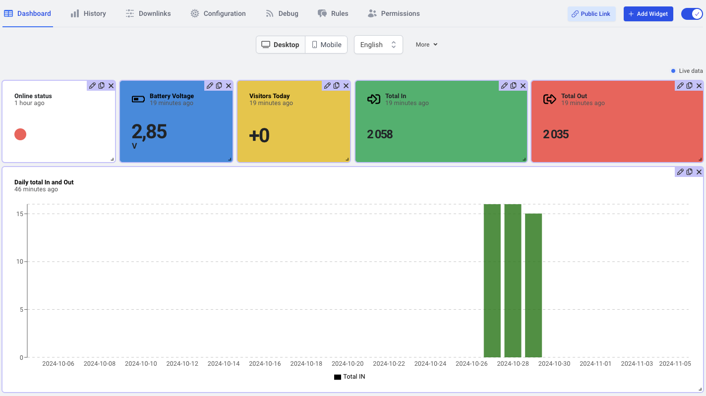
